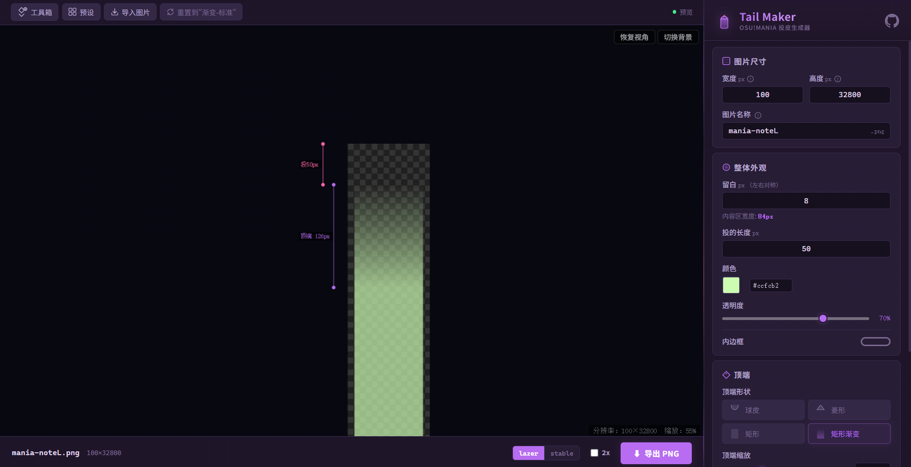
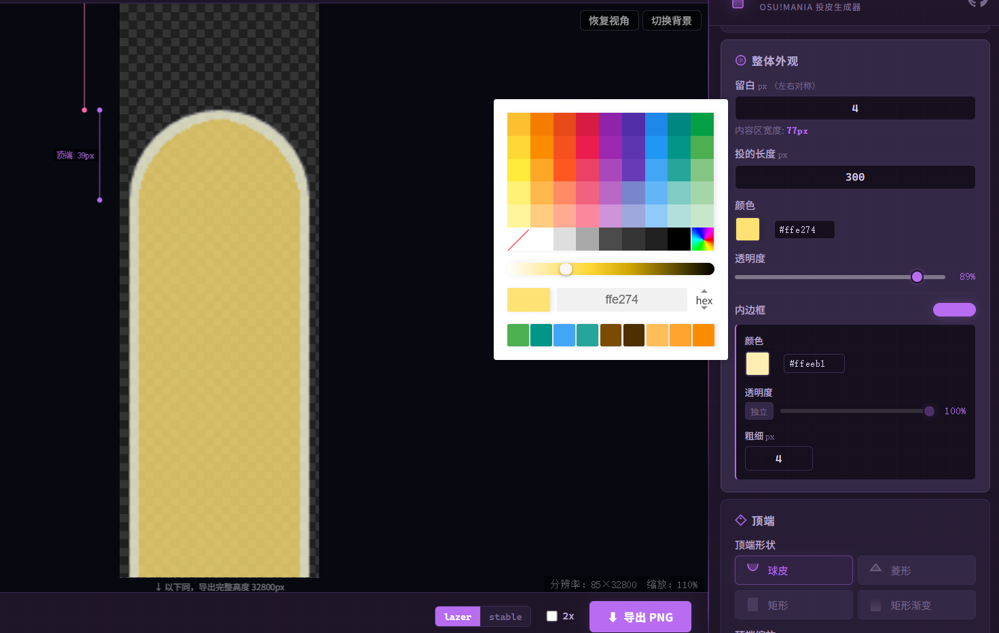
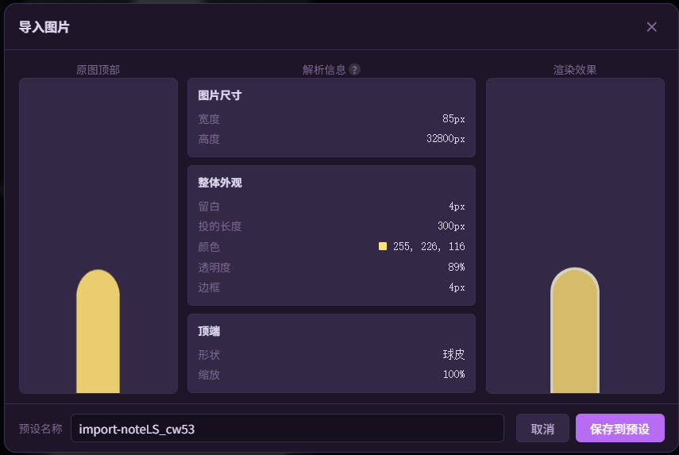

# osu!mania Tail Maker

> 一款生成 osu!mania 模式 `mania-noteL.png`（长按身体 / 投皮）的桌面工具，附带一系列皮肤制作小工具。

<p align="center">
  
</p>

## 目录

- [简介](#简介)
- [下载与安装](#下载与安装)
- [主要功能：面尾制作](#主要功能面尾制作)
- [工具箱 / 小工具](#工具箱--小工具)
- [外部小工具](#外部小工具)
- [开发与构建](#开发与构建)
- [技术栈](#技术栈)

## 简介

**osu!mania Tail Maker** 是一个专为 osu!mania 谱师和皮肤制作爱好者打造的桌面应用。它可以帮助你：

- 🎨 **可视化制作面尾** — 调节投长度、顶端形状、颜色、透明度等，所见即所得
- 🧰 **批量操作** — 批量生成不同长度的面尾图片、一键修复 lazer 皮肤适配问题
- 📦 **独立小工具** — 可将面尾修改器打包进你的皮肤文件夹，分享给其他玩家使用

<p align="center">
  
</p>

## 下载与安装

### 从 Release 下载

前往 [Releases](https://github.com/2710165659/osu-manina-tail-maker/releases) 页面，下载对应平台的最新版本：

| 平台 | 文件 |
|------|------|
| Windows | `osu-mania-tail-maker_*.exe` (安装包) |
| macOS | `osu-mania-tail-maker_*.dmg` |
| Linux | `osu-mania-tail-maker_*.AppImage` / `.deb` |

> 外部小工具 (`tail-maker-external`) 已包含在主程序的安装包内。如需单独使用，也可在 Release 中下载独立版本。

## 主要功能：面尾制作

面尾制作是本工具的核心功能，用于生成 osu!mania 中长按音符的身体图片（`mania-noteL.png`）。

### ✨ 功能一览

| 模块 | 说明 |
|------|------|
| **投长度** | 自由调节投投机取巧的长度（像素），所见即所得 |
| **球皮形状** | 支持球皮、菱形、矩形、渐变四种顶端样式 |
| **身体填充** | 自定义身体区域的颜色、透明度，支持独立设置 |
| **身体边框** | 可选边框，独立调节颜色、粗细、透明度 |
| **全局外观** | 统一设置整体透明度、留白边距、图片尺寸 |
| **特效** | 尾部残影，支持颜色和参数微调 |

### 🎛️ 操作方式

1. **右侧配置面板** — 所有参数都在这里调节，改动即时生效
2. **左侧实时预览** — 所见即所得，支持缩放/拖拽查看细节
3. **预设系统** — 内置多种预设，一键套用
4. **导出 PNG** — 一键导出，直接放入 skin 文件夹使用

<p align="center">
  
</p>

### 📐 预设管理

- **内置预设**：提供几种常用配置，开箱即用
- **自定义预设**：保存你的专属配置，支持重命名和删除
- **导入图片**：可直接导入图片并解析为系统支持形式

<p align="center">
  
</p>

## 工具箱 / 小工具

- **批量图片生成：** 根据预设批量生成不同投长度的面尾图片。配置起始长度、步长和终止长度，自动生成一系列图片到目标文件夹。支持多预设同时生成。
- **Lazer 皮肤适配：** 修复投皮转换为 osu!lazer 后，面尾拉伸或 KeyD 等图片拉伸的问题。操作前会自动备份原始文件到 `_backup` 文件夹，安全可回退。
- **一键修改面尾：** 快速修改皮肤中所有面尾图片的投长度。选择皮肤文件夹，选择预设，一键批量替换。支持 lazer 投长度自动计算。
- **为皮肤添加脚本：** 将外部小工具（一键修改面尾）打包到皮肤文件夹的 `scripts` 目录下。可将工具随皮肤一起分发，玩家双击即可使用预设或一键修改投长度。

## 外部小工具

`tail-maker-external` 是一个独立的 Tauri 桌面应用，相当于「一键修改面尾」的独立版本。它被集成在主程序的资源目录中，也可以单独运行。

- 🪶 **轻量独立** — 无需安装主程序，可随皮肤一起分发
- ⚡ **即开即用** — 双击打开，选择皮肤文件夹，一键修改
- 🔗 **与主程序共享** — 算法、逻辑一致

## 开发与构建

### 环境要求

| 工具 | 最低版本 | 说明 |
|------|----------|------|
| [Rust](https://rustup.rs/) | 1.77.2+ | 后端逻辑与 Tauri |
| [Node.js](https://nodejs.org/) | 18+ | 前端构建 |
| npm | 9+ | 包管理 |

### 克隆项目

```bash
git clone https://github.com/2710165659/osu-manina-tail-maker.git
cd osu-manina-tail-maker
```

### 安装依赖

```bash
cd tauri-tail-maker
npm install
```

### 开发模式

**Windows (PowerShell):**

在项目根目录执行：

```powershell
.\run-dev.ps1
```

该脚本会自动检测外部小工具的代码是否有更新，按需编译，然后启动 Tauri 开发服务器。

**手动启动：**

```bash
# 1. 先编译外部小工具（如需要）
cargo build --release -p tail-maker-external

# 2. 启动主应用开发服务器
cd tauri-tail-maker
npm run tauri dev
```

### 生产构建

**Windows (PowerShell):**

```powershell
.\run-build.ps1
```

**手动构建：**

```bash
# 1. 编译外部小工具
cargo build --release -p tail-maker-external

# 2. 构建主应用（前端 + Tauri 打包）
cd tauri-tail-maker
npm run tauri:build
```

构建产物位于 `tauri-tail-maker/src-tauri/target/release/bundle/`。

### 仅构建外部小工具

```bash
cargo build --release -p tail-maker-external
# 二进制位于 target/release/tail-maker-external[.exe]
```

### 项目结构

```
osu-manina-tail-maker/
├── shared/                  # 共享 Rust 库（皮肤解析、投长度计算等）
├── tauri-tail-maker/        # 主应用
│   ├── src/                 # Vue 3 前端源码
│   │   ├── components/      # Vue 组件
│   │   │   ├── ConfigPanel/ # 配置面板（参数调节）
│   │   │   ├── PreviewPanel/# 预览面板 + 工具栏
│   │   │   ├── ToolPanel/   # 工具箱各功能
│   │   │   └── shared/      # 共享 UI 组件
│   │   ├── composables/     # 组合式函数
│   │   └── types/           # TypeScript 类型定义
│   └── src-tauri/           # Tauri Rust 后端
├── tauri-tail-maker-external/ # 外部小工具
│   ├── frontend/            # 原生 HTML/CSS/JS 前端
│   └── src/                 # Rust 后端
├── run-dev.ps1              # 开发启动脚本
├── run-build.ps1            # 构建脚本
├── Cargo.toml               # Rust workspace
└── README.md
```

## 技术栈

| 层级 | 技术 |
|------|------|
| 桌面框架 | [Tauri 2](https://v2.tauri.app/) |
| 后端语言 | Rust |
| 前端框架 | Vue 3 + TypeScript |
| 构建工具 | Vite |
| 图片处理 | `image` / `imageproc` / `tiny-skia` (Rust) |
| 打包 | Tauri Bundler |

## License

MIT

